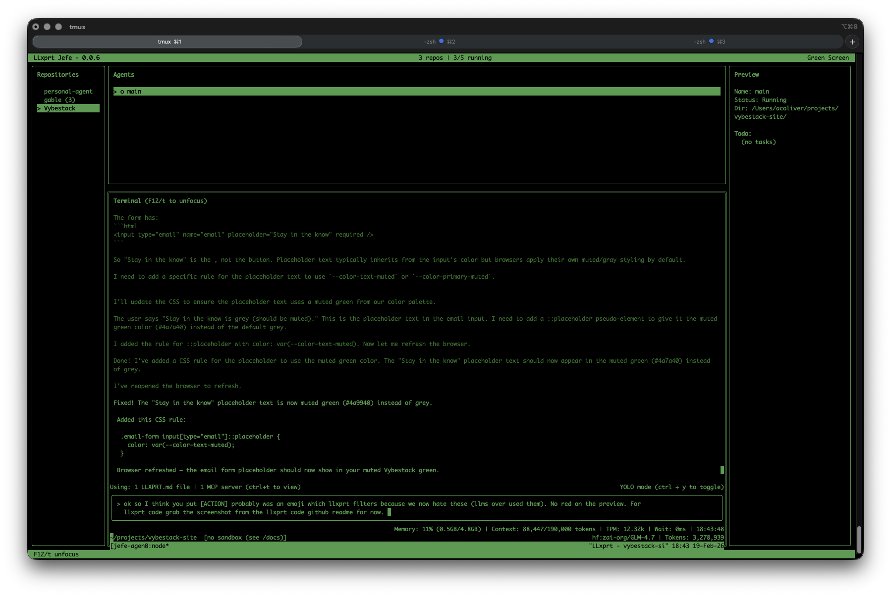

# jefe

Terminal UI for running and managing multiple `llxprt` coding agents across repositories.



## What it does

`jefe` gives you one place to:

- organize repositories,
- create and run multiple coding agents (each in its own tmux-backed session),
- watch status/output across agents,
- jump directly to an agent and attach keyboard input to it,
- manage agents (edit, kill, relaunch, delete),
- switch themes and keep state persisted between runs.

Instead of juggling many terminal tabs/windows, `jefe` keeps the workflow in a single fullscreen TUI.

## How it works (high level)

`jefe` is a Rust application built around:

- **iocraft + crossterm** for terminal UI and input events,
- **portable-pty + tmux** for process/session hosting,
- **alacritty_terminal** for terminal emulation and screen snapshots,
- **serde/json** for persistence.

Runtime model:

1. Each agent maps to a tmux session.
2. `jefe` keeps one attached viewer PTY for rendering/interacting with the selected running agent.
3. UI state is event-driven (`AppEvent` + deterministic state transitions in `AppState`).
4. A render loop snapshots current state + terminal content and draws dashboard/split/modal views.
5. Settings/state are loaded at startup and saved on mutation.

## Main UI modes

- **Dashboard**: repositories, agents, terminal, preview.
- **Split view**: compact cross-agent operational view.
- **Form / Confirm / Search / Help** modals.
- **Terminal capture mode**: key/mouse input forwarded into selected running agent.

## Keyboard highlights

- `F12` / `t`: toggle terminal capture focus.
- `Alt+1..9` (plus macOS Option-symbol fallback): jump to agent shortcuts.
- `n` / `N`: new agent / new repository.
- `Ctrl-d`: delete selected.
- `Ctrl-k`: kill selected agent.
- `l`: relaunch dead agent.
- `s`: split view.
- `?` / `h` / `F1`: help.

## Persistence and paths

By default, `jefe` resolves settings/state using platform paths, with env var overrides:

- `JEFE_SETTINGS_PATH`
- `JEFE_CONFIG_DIR`
- `JEFE_STATE_PATH`
- `JEFE_STATE_DIR`

Related runtime/env toggles:

- `JEFE_WINDOWED=1` to disable fullscreen mode.
- `JEFE_LOG_FILE` and `JEFE_LOG` for structured logging output/filtering.

## Requirements

- Rust toolchain (edition 2024 crate).
- `tmux` installed and available on PATH.
- `llxprt` CLI installed separately and available on PATH.
- A terminal with proper UTF-8 + color support.

## Install with Homebrew (recommended)

`jefe` is published via the Vybestack tap:

```bash
brew tap vybestack/tap https://github.com/vybestack/homebrew-tap
brew install jefe
```

`jefe` does **not** install `llxprt` for you. Install `llxprt` separately and ensure it is on PATH.

## Build and run

```bash
cargo run
```

Version:

```bash
cargo run -- --version
```

## Development verification

```bash
cargo fmt
cargo check -q
cargo test -q
cargo clippy --all-targets --all-features -- -D warnings
```

## Project structure

- `src/main.rs` — app entry + event/render loop wiring.
- `src/state/` — app state machine and events.
- `src/runtime/` — tmux/PTTY attach, input, snapshots, liveness.
- `src/ui/` — screens/components/modals.
- `src/theme/` — themes and color resolution.
- `src/persistence/` — load/save settings and state.
- `docs/` — technical and product docs.
