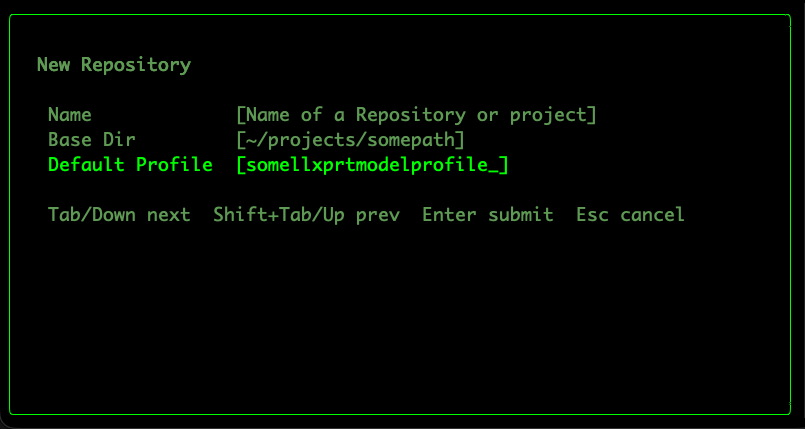
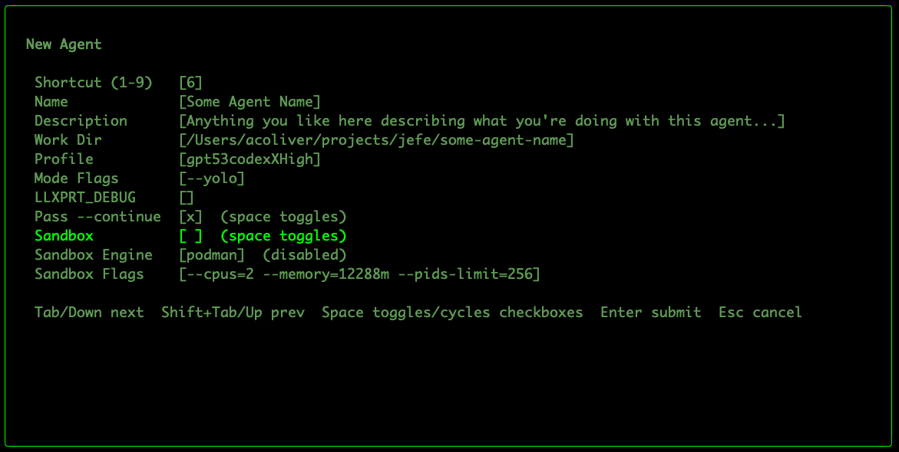

# Getting started with LLxprt Jefe

This guide is for the common first-run workflow:

1. Create a repository in Jefe.
2. Create your first agent in that repository.
3. Start working without terminal-tab chaos.

---

## 1) Create a repository

From the dashboard, press `N` (capital N) to open **New Repository**.

### Repository fields

- **Name**
  - Friendly label shown in Jefe’s repository list.
  - Example: `LLxprt Code`, `payments-service`, `client-foo`.

- **Base Dir**
  - The root path on disk for this repository.
  - This is the default location used when creating new agents.
  - If you leave it empty, Jefe falls back to a temp path (`/tmp/<slug>`), but in practice you almost always want a real project path.

- **Default Profile**
  - Optional llxprt profile to prefill for new agents in this repository.
  - Leave blank to use llxprt defaults.

### Submit / navigation

- `Tab` or `Down`: next field
- `Shift+Tab` or `Up`: previous field
- `Enter`: submit
- `Esc`: cancel

After submit, the repository is added and selected.

---

## 2) Create an agent

With your repository selected, press `n` (lowercase n) to open **New Agent**.

### Agent fields and what they mean

- **Shortcut (1-9)**
  - Optional quick-jump slot for `Alt+1..9`.
  - `0` clears the shortcut.

- **Name**
  - Agent label in the UI (required to create the agent).

- **Description**
  - Optional context note for you/team (what this agent is for).

- **Work Dir**
  - Filesystem path where llxprt runs.
  - For **new** agents, Jefe auto-generates this from repository base dir + agent name until you edit this field manually.

- **Profile**
  - llxprt profile name (`--profile-load`).
  - Blank means use llxprt default behavior.

- **Mode Flags**
  - Extra llxprt CLI flags.
  - Defaults to `--yolo` when empty.

- **LLXPRT_DEBUG**
  - Optional debug env value for llxprt.
  - Leave blank unless you are debugging llxprt behavior.

- **Pass --continue** (checkbox)
  - When enabled, Jefe launches llxprt with `--continue`.

- **Sandbox** (checkbox)
  - Enables llxprt sandbox mode for this agent.
  - **Strong recommendation:** turn this on whenever your environment supports it.

- **Sandbox Engine**
  - Engine used for sandboxing (cycles with space in the form).
  - Typical options include `podman`, `docker`, and `sandbox-exec` depending on platform.

- **Sandbox Flags**
  - Resource limits/options passed via `SANDBOX_FLAGS`.
  - Jefe defaults to:
    - `--cpus=2 --memory=12288m --pids-limit=256`

### Submit / navigation

- `Tab` or `Down`: next field
- `Shift+Tab` or `Up`: previous field
- `Space`: toggle checkboxes / cycle sandbox engine
- `Enter`: submit
- `Esc`: cancel

After submit, the agent is created and selected.

---

## Recommended baseline for most users

- Set a real repository **Base Dir**.
- Use a clear agent **Name** + short **Description**.
- Keep **Sandbox** enabled whenever possible.
- Start with default sandbox flags unless you know you need different limits.

If copy/paste from llxprt ever behaves oddly inside Jefe, check the tmux note in the main README.
