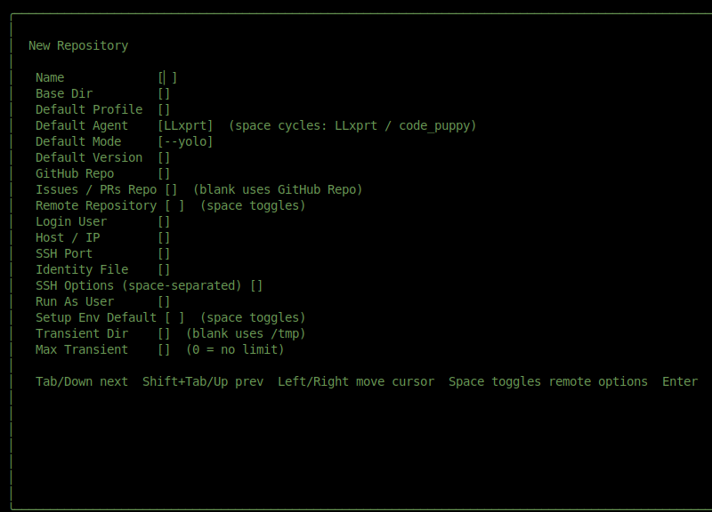
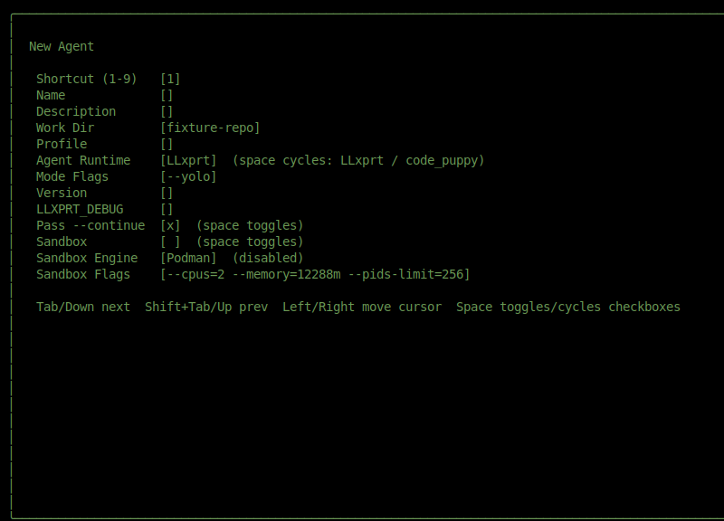
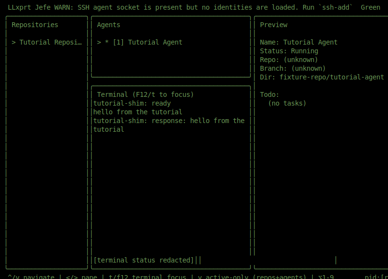
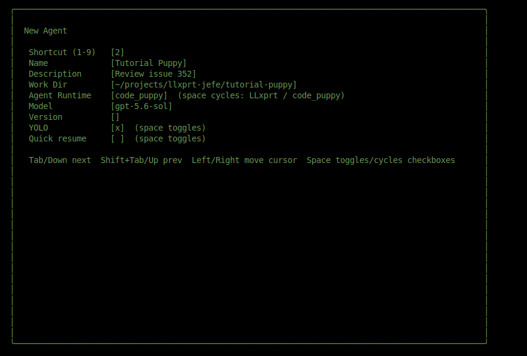
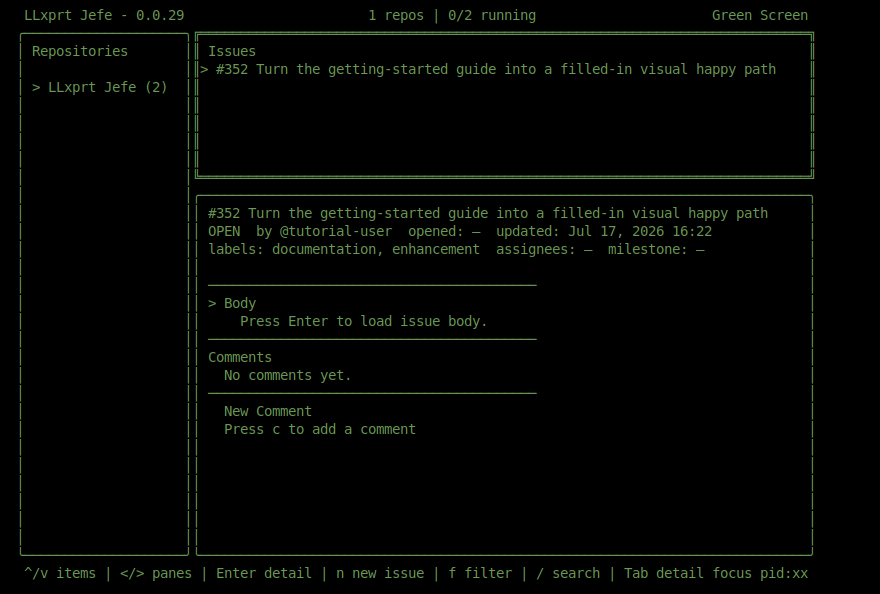
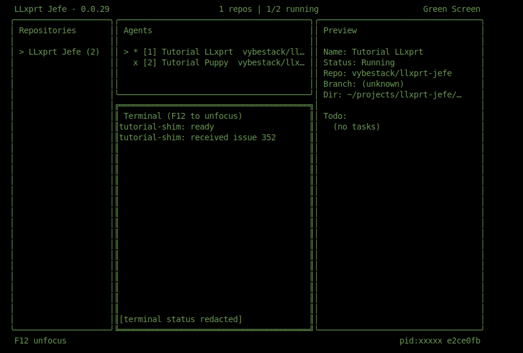
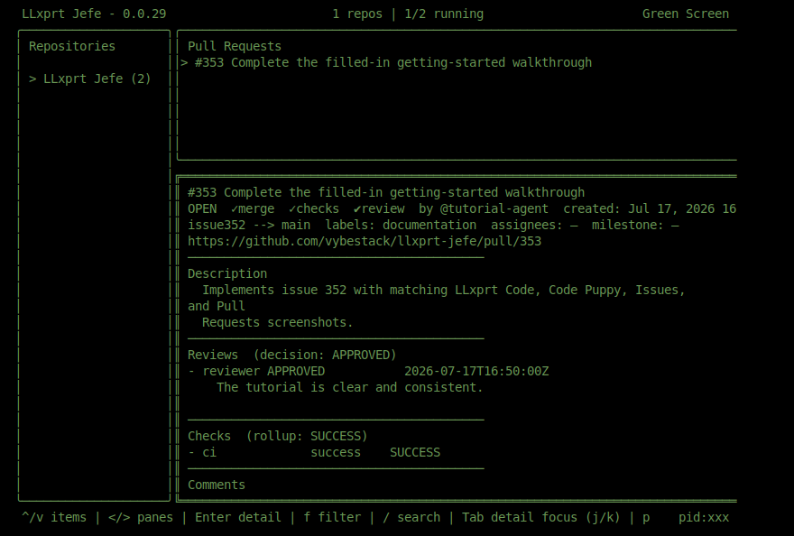
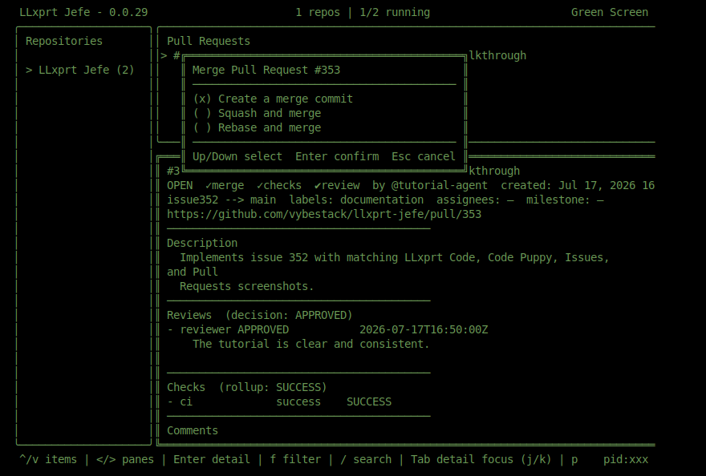

# Getting started with LLxprt Jefe

This tutorial follows one complete path through Jefe: add a repository, create one LLxprt Code agent and one Code Puppy agent, send an issue to an agent, and merge the resulting pull request.

The screenshots use a deterministic local fixture named `vybestack/llxprt-jefe`, issue 352, and PR 353 so every image tells one consistent story. **Do not send or merge those literal upstream items unless you maintain that repository.** In the steps below, use a repository you own and select the issue and PR produced in that repository.

For the full list of fields, keys, and alternate configurations, use the [UI and configuration reference](overview.md).

## Before you start

Install Jefe, `tmux`, the GitHub CLI (`gh`), and both runtimes used in this walkthrough: `llxprt` and `code-puppy`. Configure their provider credentials before continuing.

Authenticate the GitHub CLI, then fork `vybestack/llxprt-jefe` into your own account if you do not already have a writable tutorial repository:

    gh auth login
    gh auth status
    gh repo fork vybestack/llxprt-jefe --clone=false
    GH_USER=$(gh api user --jq .login)

Create the two clean checkouts used by the agents:

    mkdir -p ~/projects/llxprt-jefe
    git clone "https://github.com/$GH_USER/llxprt-jefe.git" ~/projects/llxprt-jefe/tutorial-llxprt
    git clone "https://github.com/$GH_USER/llxprt-jefe.git" ~/projects/llxprt-jefe/tutorial-puppy
    git -C ~/projects/llxprt-jefe/tutorial-llxprt status --short
    git -C ~/projects/llxprt-jefe/tutorial-puppy status --short

Both status commands should print nothing. In the Jefe forms, replace the screenshot’s `vybestack/llxprt-jefe` repository values with `$GH_USER/llxprt-jefe`.

The screenshots use an LLxprt profile named `tutorial`. If you already have a working profile, use its name instead. Otherwise leave **Default Profile** and **Profile** blank to use LLxprt’s configured default behavior; the rest of the flow is unchanged.

Launch Jefe:

    jefe

Jefe opens on the dashboard. The repository list is on the left, agents and their terminal are in the middle, and the selected item’s preview is on the right. The key bar along the bottom changes with the current screen.

## 1. Add the repository

Press capital **N** to open **New Repository**, then enter these values:

| Field | Value |
| --- | --- |
| Name | `LLxprt Jefe` |
| Base Dir | `~/projects/llxprt-jefe` |
| Default Profile | `tutorial` |
| Default Agent | `LLxprt` |
| Default Mode | `--yolo` |
| Transient Dir | `~/projects/llxprt-jefe/transient` |
| Max Transient | `2` |
| GitHub Repo | `vybestack/llxprt-jefe` |
| Issues / PRs Repo | `vybestack/llxprt-jefe` |

Use **Tab** to move to the next field. Leave the other fields at their displayed defaults. Your completed form should look like this:

Press **Enter**. Jefe returns to the dashboard with **LLxprt Jefe** selected.

## 2. Create and use an LLxprt Code agent

With **LLxprt Jefe** selected, press lowercase **n** to open **New Agent**. Enter:

| Field | Value |
| --- | --- |
| Shortcut | `1` |
| Name | `Tutorial LLxprt` |
| Description | `Implement issue 352` |
| Work Dir | `~/projects/llxprt-jefe/tutorial-llxprt` |
| Profile | `tutorial` |
| Agent Runtime | `LLxprt` |
| Mode Flags | `--yolo` |
| Pass --continue | enabled |

The repository defaults fill several of these values. Confirm that the completed form matches the tutorial before continuing:

Press **Enter**. Jefe launches the agent and gives the terminal keyboard focus. Type:

    hello from the tutorial

Press **Enter** and wait for the response. Then press **F12** to return keyboard control to Jefe. The terminal remains visible as a read-only preview:

If ordinary navigation keys appear in the terminal instead of moving through Jefe, press **F12** again. This terminal-capture boundary is the most important navigation concept in Jefe.

## 3. Create a Code Puppy agent

Press lowercase **n** again. Enter:

| Field | Value |
| --- | --- |
| Shortcut | `2` |
| Name | `Tutorial Puppy` |
| Description | `Review issue 352` |
| Work Dir | `~/projects/llxprt-jefe/tutorial-puppy` |
| Agent Runtime | `code_puppy` |
| Model | `gpt-5.6-sol` |
| YOLO | enabled |

Move to **Agent Runtime** and press **Space** to change it from `LLxprt` to `code_puppy`. The LLxprt-only fields are replaced by Code Puppy settings. Fill the model and enable YOLO:

Press **Enter** and wait for Code Puppy to start. Press **F12** to return control to Jefe.

The next step sends work to an existing agent. Jefe offers persistent agents that are not currently running, so select **Tutorial Puppy**, press **Ctrl-K** to stop it, select **Tutorial LLxprt**, and press **Ctrl-K** again. Each preview should report **Status: Dead**.

## 4. Send an issue to an agent

Create or choose a small documentation issue in your writable repository. Press lowercase **i** to open **Issues**; Jefe scopes the list to the **Issues / PRs Repo** configured earlier.

The fixture screenshot uses issue **352**, **Turn the getting-started guide into a filled-in visual happy path**. In your session, select the issue you created:

Press **Enter** to load the issue detail, then press capital **S** to open **Send to Agent**. Keep **Tutorial LLxprt** selected and press **Enter**. Jefe verifies the checkout, prepares the issue context, and launches LLxprt with the delivery instructions.

Jefe also attempts to assign the issue to the authenticated GitHub user; assignment failure is reported as a warning but does not discard the handoff. The agent now has the issue title, body, repository context, and Jefe’s delivery contract. That contract asks it to work on a dedicated branch, verify the change, open a linked pull request, and follow CI and review feedback to completion.

## 5. Inspect the resulting pull request

After the agent opens a pull request in your repository, press lowercase **p** to open **Pull Requests**. Select the PR produced by your issue and press **Enter**. Do not select PR 353 in the upstream repository; that number exists only in the deterministic screenshot fixture.

Before merging, check the detail view. In the fixture, PR **353**, **Complete the filled-in getting-started walkthrough**, is approved, its `ci` check passed, and it is mergeable:

Do not merge until your PR’s required reviews and checks are complete.

## 6. Squash and merge the pull request

With your PR’s detail selected, press lowercase **m**. Jefe opens the merge-method chooser:

Press **Down** to select **Squash and merge**, then press **Enter**. Jefe displays **Press Enter to confirm merge**. Review the method one final time and press **Enter** again.

The PR detail refreshes to **MERGED**. You have now completed the happy path: configured a repository, used both supported runtimes, handed an issue to an agent, inspected its pull request, and merged the result.

## Next steps

Use the [overview and UI reference](overview.md) when you need alternate runtime versions, sandbox settings, filters, comments, pagination, transient agents, repository editing, or the complete keyboard reference.

Press **?**, **h**, or **F1** in Jefe for context-sensitive help. If copy and paste behaves unexpectedly inside an agent terminal, see the tmux clipboard guidance in the [main README](../README.md).
