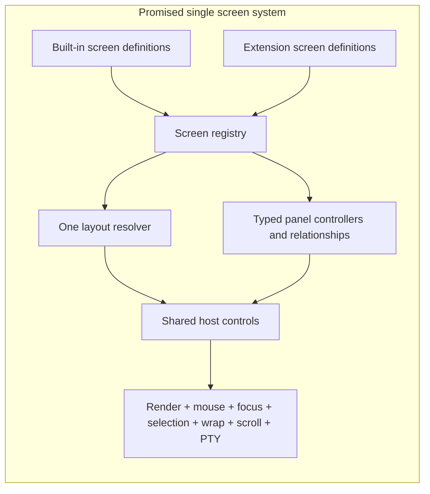
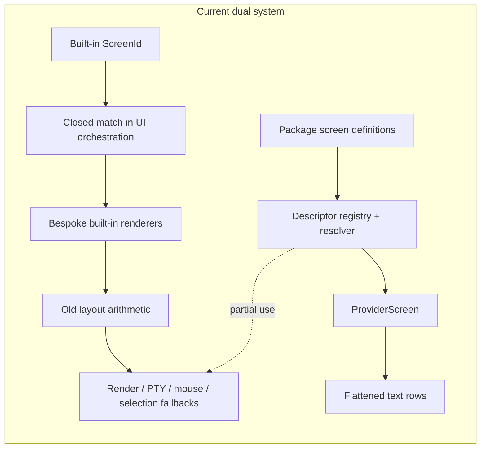
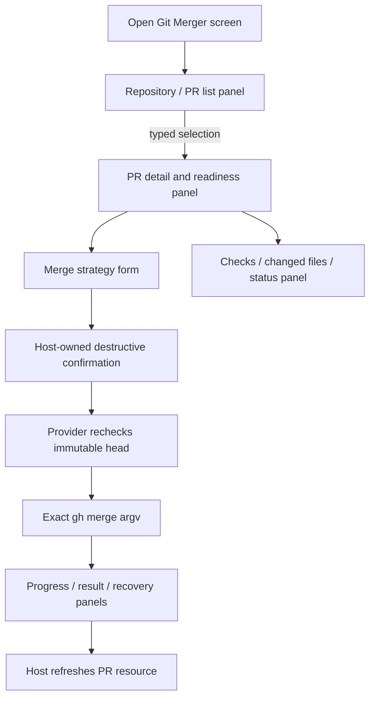
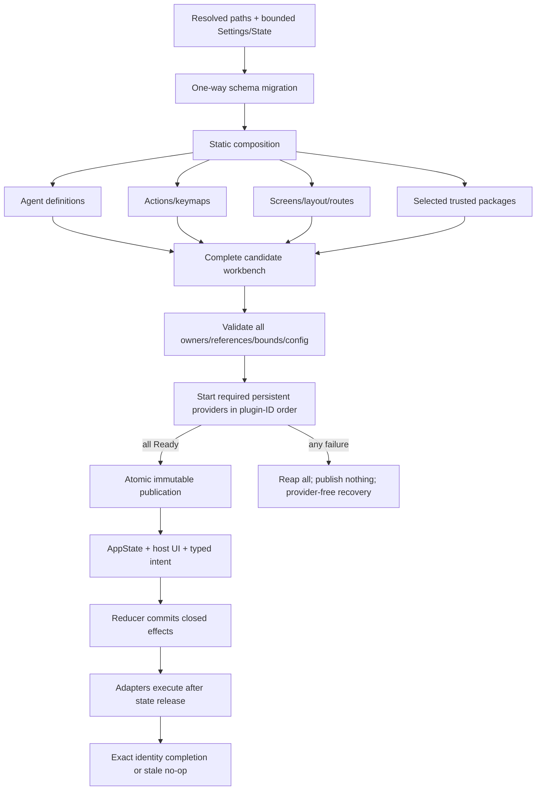
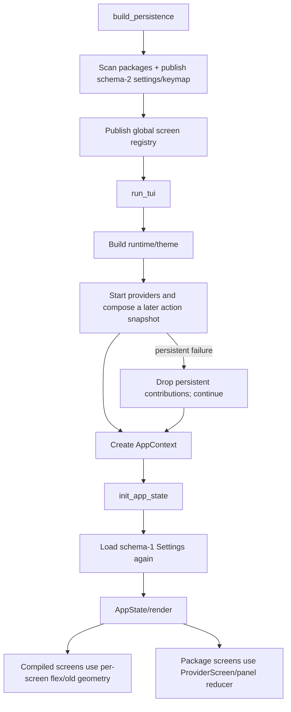

# Architecture and Delivery Audit — CW-12 / Issue #392

**Audit target:** GitHub issue #392, in parent epic #379, through `c985c4cf` on branch `issue392` (identical to `origin/main` when inspected).  
**Repository state:** no #392 implementation exists; `packages/` does not exist. Untracked local runtime files were not inspected as source authority and were not modified.  
**Method:** issue bodies/comments, merged PRs and checks, commit history, project plans/public contracts, current Rust source, tests, scenario fixtures, static scans, and focused test execution. Closed issue state was treated only as metadata.

## Product-level correction and decisive finding

> **The blunt answer: no, current HEAD is not implementing the screen architecture described in `project-plans/newarchitecture/` as an end-to-end product.**
>
> It has implemented a substantial package/provider subsystem and a substantial screen-definition subsystem, but it did **not** complete the central cutover that was supposed to make those subsystems the way Jefe itself defines and renders screens. The result is a second UI path beside the original application.

This is not merely “unfinished polish.” The load-bearing promise was:

> Every built-in and extension screen is composed from definitions, panel instances, a layout tree, typed relationships, focus rules, and actions; Jefe renders those panels through shared host controls; one resolved layout drives rendering, mouse, selection, wrapping, scrolling, focus, and PTY sizing.

Current HEAD instead has two different UI systems.





### What was supposed to be delivered

The referenced architecture is explicit, not ambiguous:

1. **Jefe’s own screens become definitions.** Dashboard, Repositories, Issues, Pull Requests, and Actions were to be compiled defaults in the same screen registry used by user and package screens.
2. **A screen definition is the real composition.** It owns panel instances, layout, focus order, bindings, and typed same-screen relationships.
3. **Extension authors can define complete screens.** Not arbitrary terminal drawing, but substantial native UI assembled from host-rendered list, detail, form, status, progress, empty, and error controls.
4. **Built-ins and extensions use the same presentation machinery.** This is what makes extension UI native-looking and prevents a second UI runtime.
5. **One geometry result owns all geometry.** Rendering, hit testing, text selection, wrapping, scrolling, focus, and the real PTY size consume the same immutable snapshot.
6. **Relationships perform real data coordination.** Scope, master-detail, and session-target edges move typed values between panel instances; they are not merely manifest validation metadata.
7. **The old authorities are deleted.** The epic’s no-shim policy expressly prohibits leaving the old screen/layout/input authorities active beside the new ones.

### What current HEAD actually is

The clearest description is:

> **A capable supervised package/provider platform attached to a partially adopted screen-definition framework, while the visible built-in application still runs mostly through its old screen-specific UI and geometry code.**

That platform is not fake. It includes useful and well-built pieces:

- data-driven agent definitions;
- a real action/key registry;
- package discovery, versions, installation, trust, and configuration;
- transactional static screen composition;
- supervised one-shot and persistent providers;
- typed panel snapshots and panel events;
- generated package Settings fields;
- package-owned screens that can be entered through provider navigation.

But those pieces do not add up to the promised workbench because the central screen cutover was not completed.

### Promise-to-reality classification

| Promised capability | Classification | Current reality |
|---|---|---|
| Stable `ScreenId` replaces `ScreenMode` | **Compliant foundation** | `ScreenMode` is gone and stable identities are real. |
| Validated layout trees and deterministic resolver | **Compliant foundation** | The resolver and collapse/tiny behavior exist and are substantial. |
| Package-owned screens can be composed and opened | **Partial implementation** | This works for package screens through provider navigation. |
| Every built-in screen is definition-driven | **Contradiction** | UI orchestration still performs a closed match and constructs bespoke screen components. Most built-in renderers do not consume `ResolvedLayout`. |
| One geometry snapshot drives every consumer | **Contradiction** | Old geometry still drives the actual PTY, terminal mouse regions, and several render/selection/wrap paths. The new snapshot and old arithmetic are both active. |
| Host-rendered standard controls for extension panels | **Drift / narrowing** | Protocol models exist, but `ProviderScreen` flattens list/detail/form/status/error models into text rows rather than using the same rich controls as built-in screens. |
| Typed relationships coordinate panel instances | **Infrastructure only** | Validation and propagation code exist, but production reduces relationships to a boolean check and discards propagated values. Scope and session-target are not operating as the screen model promised. |
| User-authored `local.*.screen.toml` screens are useful | **Infrastructure only** | They are discovered, parsed, validated, and composed, but have no general entry path, no built-in-panel renderer dispatch, and no usable input path. |
| Screen-declared bindings operate | **Infrastructure only** | Bindings are lowered into descriptors but have no production consumer. |
| Superseded screen/layout authorities are deleted | **Contradiction** | Old per-screen layout arithmetic, closed selectable-pane mappings, geometry fallbacks, and domain-specific input modes remain active. |
| Atomic workbench publication after providers are ready | **Drift** | Static registries publish transactionally, but provider startup failure degrades after package screens are already present instead of aborting the aggregate as the epic requires. |

### The concrete “second evil head”

The problem is not merely duplicated code. The two paths can disagree in live behavior.

```text
Screens/Layout editor
        |
        v
changes descriptor layout
        |
        +----> ResolvedLayout ----> mouse hit regions
        |
        X
        +----> bespoke built-in renderer still draws old layout
```

A user can therefore edit a built-in layout so the descriptor moves the click targets while the bespoke renderer leaves the visible panes in their old places. Likewise, the resolver can size the terminal widget while the old `compute_pty_layout` path determines the dimensions sent to the actual child PTY.

This is exactly what the epic’s no-dual-authority rule was designed to prevent.

### What an extension can provide today

A package can provide a standalone package-owned screen containing declared list/detail/form/status/progress/error panels. It can run a persistent provider, publish snapshots, receive panel events, and navigate into that screen.

However, the practical UI is closer to this:

```text
+ Pull Requests ----------------+
| >> PR 41                      |
|    PR 42                      |
+-------------------------------+
+ Detail -----------------------+
| title: Fix provider startup   |
| state: open                   |
| author: user                  |
+-------------------------------+
+ Merge ------------------------+
| strategy: squash             |
| submit: merger.merge         |
+-------------------------------+
```

It is not yet the intended native workbench composition:

```text
+ Git Merger ---------------------------------------------------+
| Repository / PR list        | Pull request detail             |
| interactive native list    | structured native detail       |
|                             |                                 |
| selection --master-detail-> |                                 |
+-----------------------------+---------------------------------+
| Merge strategy form         | Checks / progress / recovery    |
| native fields and controls  | status, errors, retry actions   |
+---------------------------------------------------------------+
```

The second drawing requires shared host controls, persistent relationship state, real relationship propagation, general screen actions/navigation, and one geometry authority. Those are precisely the missing or narrowed parts.

### What Git Merger was supposed to prove

Git Merger should have been the architectural acceptance specimen for a recognizable extension-owned Git UI:



That would prove all of the important product claims together:

- a package can add a complete screen without changing Jefe;
- several native panels can be composed by declaration;
- selection and activation can drive detail through typed relationships;
- forms, focus, navigation, keymaps, confirmation, progress, and recovery remain host-owned;
- provider code owns Git behavior but not terminal rendering;
- the same screen machinery used by the package is used by Jefe’s built-ins.

Issue #392 was narrowed to a contextual action, generated config, a confirmation, and a small status panel. Worse, its required panel is meant to appear inside the existing PR screen, but current package composition can bind provider panels only to package-owned screens. The required `github.pull-request.detail` action context also does not exist; current action contexts expose only a broad PR-screen context.

Therefore #392, as written, is not merely a weak demonstration. Parts of it cannot be implemented generically on the current host contracts.

### Direct answers

**Are we implementing the architecture in these documents?**  
Not as a complete system. Several supporting capabilities are implemented well, but the central screen-model replacement is not. The implementation currently violates the architecture’s defining “one system, one authority” promise.

**Is this just random work?**  
No. The package inventory, provider supervisor, action registry, layout resolver, Settings system, and agent definitions are coherent and reusable. But they were assembled around an incomplete screen cutover, so the product is not the product the documents promise.

**Did the implementation drift?**  
Yes, materially. It drifted from “Jefe and extensions share one definition-driven UI system” to “Jefe keeps bespoke built-in screens while packages get a separate provider-text screen system.”

**Are custom/package screens real?**  
Package-owned screens are real but narrower and less native than promised. User file screens are mostly parser/validator infrastructure and are not a usable product feature. Neither establishes that Jefe itself has become definition-driven.

**Will continuing directly with current #392 achieve the general goal?**  
No. It would add another provider package on top of the split architecture. It could prove command supervision and confirmation, but it would not prove the promised extensible UI and cannot generically mount its requested panel in the built-in PR screen.

### Corrective decision

> **Stop #392 implementation. Finish the screen cutover, then rewrite #392 as the full Git Merger workbench acceptance test.**

Required order:

1. **Enforce the no-dual-authority rule now.** Bring the ownership/shim audit forward so a replacement cannot close while its old authority remains active.
2. **Finish the geometry cutover.** Make every built-in renderer, mouse target, selection/wrap/scroll calculation, focus decision, and actual PTY size consume `ResolvedLayout`; delete the superseded per-screen arithmetic and fallback paths.
3. **Make screen definitions operational.** Dispatch built-in panel types through shared panel controllers/renderers; make local and package screens reachable through generic actions/routes; consume descriptor bindings.
4. **Make relationships real state.** Store relationship values per screen instance and propagate scope/master-detail/session-target updates for built-in, local, and package screens.
5. **Use shared host controls for provider models.** Lists should be native selectable lists, details native detail views, forms native form controls, and status/error/recovery models native host components—not flattened text pretending to be those controls.
6. **Rewrite #392.** Require a package-owned Git Merger screen with multiple panels and relationships, plus an optional generic contextual action from PR detail that navigates into it with typed activation context. Declare any missing PR-detail context or host contribution slot as explicit prerequisite host work.
7. **Run the package-screen lifecycle in CI.** Parsing the scenario is not enough; the end-to-end extension UI path must execute on every relevant change.

The architecture does not need to be discarded. The delivered provider/package work should be retained. But the project must stop treating closed infrastructure issues as proof that the user-facing screen capability exists. The next work must complete the replacement promised by CW-04/CW-05 before Git Merger is used as evidence that the epic succeeded.

---
## Executive verdict

> **NO-GO on implementing #392 as currently written.**

The configurable-workbench trajectory has produced substantial, generally well-typed infrastructure: strict package manifests, selected-version composition, one provider supervisor, handle-free reducers, generated plugin config, package-contributed screens, and host-rendered provider panels. Those are real capabilities, not empty scaffolding. Current focused tests pass, and there is **no current host branch keyed on a plugin ID**.

However, #392 is not merely a package-addition ticket. It is the epic’s **reference proof** that an independently authored, relocatable package can traverse the complete generic path—install/trust/configure/restart/contextual action/confirmation/persistent panel/exact destructive child commands/refresh—without product identity code or a second authority. Current HEAD cannot prove that:

1. **The #392 artifact contract is stale and does not parse against the delivered package contract.** Current packages require `plugin.json`, embed `config` in that manifest, and select provider binaries by exact host triple. #392 still requires `manifest.json`, a separate `config-schema.json`, and one unqualified provider path. It also requires manifest process permissions, but the delivered `ManifestDraft` has no permissions field.
2. **The generic host sends provider actions empty arguments and empty resource references.** The only production call supplies `TypedMap::new()` for contextual refs (`src/app_shell_key_routing.rs:301-329`), so a PR-detail action cannot receive repository, PR, or expected-head identity.
3. **The generic confirmation path immediately stages continuation B.** It does not refresh the PR detail and compare its head before continuation (`src/state/provider_request_ops.rs:164-171`). `HEAD_CHANGED` does not exist in the host path.
4. **The provider environment cannot normally find Homebrew `gh`.** Its fixed Unix PATH is only `/usr/bin:/bin` (`src/runtime/provider/environment.rs:30-44`), while the required macOS `gh` is commonly under `/opt/homebrew/bin` or `/usr/local/bin`.
5. **The epic’s binding no-dual-authority condition is currently false.** Schema-1 Settings remains runtime-active alongside schema-2 Settings; old layout arithmetic and renderer flex layouts remain active alongside `ResolvedLayout`; and the centralized Back resolver has no production consumer.
6. **Startup is not one atomic workbench publication.** Screens publish globally before TUI startup (`src/main.rs:322-326`), while providers/actions publish later (`src/main.rs:521-526`). A required persistent-provider failure degrades and continues (`src/startup_providers.rs:50-65,137-146`) after package screens have already published, contrary to #379’s “all Ready, then atomically publish; otherwise publish nothing” rule.
7. **CW-11’s visible evidence is narrower than its issue contract.** The panel happy path is real, but the distinct panel/config normal/focused/unavailable/error/dirty/recovery/small scenario matrix is not present. The principal panel scenario embeds a shell provider and covers one selected-version happy lifecycle.

The path can still achieve the epic, but **not by continuing to append #392 artifacts to the present seams**. It needs a bounded cutover/reconciliation first. Otherwise CW-12 will either be impossible, introduce plugin-specific host behavior, or create yet another parallel package/context/geometry/persistence path.

---

## 1. What the epic is actually trying to achieve

Issue #379’s general goal is not “add plugins” and not “add configurable screens.” It is to replace Jefe’s closed, product-specific workbench with **one restart-applied, lossless, immutable, capability-composed workbench**:

- static definitions and packages are discovered without executing untrusted processes;
- configuration is lossless and has one document/writer authority;
- agents, actions, screens, layout, navigation, packages, provider actions, panels, and config compose through versioned closed contracts;
- all active contributions validate before publication;
- persistent providers all reach Ready before publication;
- UI renders host-owned descriptors and emits typed semantic intent;
- reducers are deterministic and I/O-free;
- effects execute after commit and reject stale identity;
- disabled/unknown owner data remains dormant and byte-preserved;
- superseded runtime authorities are deleted, not wrapped or retained;
- extension authors can verify unchanged installed artifacts offline.

The binding success criterion is therefore **replacement and one authority**, not module count. Issue #379’s EPIC-01 and authoritative startup flow require one immutable aggregate; EPIC-13 prohibits compatibility shims, dual code paths, and superseded types outside one-way persistence migration.

### Intended authority flow



### Current aggregate flow



This is multiple sequential authorities, not the epic’s single publication transaction.

---

## 2. What #392 is meant to prove

CW-12 is an **architectural acceptance specimen**. The package itself is deliberately small enough that any host special case is unjustifiable. It must prove all of the following together:

1. A package can be built and relocated independently of a development checkout.
2. The existing package manifest, selected-version, trust, config, provider, action, panel, navigation, and confirmation contracts are sufficient without adding a host capability.
3. A host-native PR detail snapshot can become a closed provider request generically, without checking `com.example.git-merger`.
4. A destructive provider continuation is single-use, generation/context bound, and revalidates live host context before invocation B.
5. The provider can run exact argv-only `gh pr view` and exactly one strategy-specific `gh pr merge`, with no shell, admin, auto, branch deletion, or automatic destructive retry.
6. Panel progress/error/status is ephemeral, host-rendered, and owned by the existing panel lifecycle.
7. Disable/restart removes all contributions while preserving dormant config.
8. Installed artifacts, observations, and captures contain neither secrets nor development paths.
9. The same unchanged package works in installed macOS/Linux layouts.
10. Source contains no package-identity branch.

If CW-12 needs a bespoke host adapter keyed by plugin identity, a second manifest/config format, a provider-specific modal, a custom process supervisor, or package-specific panel rendering, it has disproved the epic.

### Intended #392 end-to-end path

```mermaid
sequenceDiagram
    participant U as User
    participant H as Generic Host Context Adapter
    participant R as Provider Request Reducer
    participant P as Git Merger Provider
    participant G as gh child
    participant PR as GitHub PR snapshot

    U->>H: invoke declared action in github.pull-request.detail
    H->>PR: read immutable current detail snapshot
    H->>R: closed refs + strategy + expected_head_oid
    R->>P: invocation A
    P-->>R: request-host-confirmation
    R-->>U: host-rendered destructive confirmation
    U->>R: approve
    R->>PR: refresh current PR detail
    R->>R: compare current head to expected head
    alt head changed
        R-->>U: HEAD_CHANGED; no continuation
    else unchanged
        R->>P: fresh invocation B with bound continuation
        P->>G: gh pr view ... --json headRefOid,state,isDraft,mergeStateStatus
        G-->>P: closed JSON
        P->>G: gh pr merge ... --strategy --match-head-commit oid
        G-->>P: exit status
        P-->>R: progress + refresh + notice OR typed error
        R->>PR: refresh exact current resource
    end
```

### Current breakpoints

```text
PR detail snapshot
   └─X─> contextual resource refs        (host sends {})
        └─X─> expected_head_oid request  (host sends arguments {})
             └─> provider confirmation A (generic support exists)
                  └─X─> host PR refresh/head check
                       └─> continuation B (currently immediate)
                            └─X─> reliable gh discovery on macOS PATH
```

---

## 3. Prerequisite audit

### Declared prerequisites

| Prerequisite | Declared purpose for #392 | Current verdict | Evidence and consequence |
|---|---|---:|---|
| **CW-08 / #388** | Settings Agent Types, Screens/Layout, Keys editors; sparse lossless edits; restart application | **Partial, API-usable** | Three editors and 21 scenarios exist; standalone Keys duplicate was deleted. Current composition now consumes layout overrides and order (`src/workbench/compose.rs:113-136,246-297`), a later repair beyond #388’s original non-goal. Focused composition tests passed. But the transitive Settings foundation still has an active schema-1 reader, and #388’s own plan explicitly treated runtime order/layout consumption as a non-goal before later work repaired it. Sufficient editor APIs exist, but the epic-level prerequisite is not cleanly complete. |
| **CW-11 / #391** | Persistent panels, generated config, migration, selected package screens, host rendering | **Partial, substantial** | Selected package screens/panels/config and migration are real (`src/workbench/compose.rs:93-207`; `src/domain/plugin_config.rs`; `src/state/provider_panels*.rs`; `src/runtime/provider/migration.rs`). Focused panel/config/migration suites passed. One real persistent package-panel TUI path exists. But aggregate publication is not atomic; persistent failure degrades after screen publication; required distinct UI-state scenarios are incomplete; and no PR-context adapter exists. |

### Transitive foundations

| Foundation | Required by | Verdict | Key evidence |
|---|---|---:|---|
| CW-00 harness | almost every capability | **Complete at current HEAD** | Strict schema-1 harness exists under `src/harness/v1`; the old parser/harness was deleted during #383. PR #402 initially left the old harness intentionally, so #380 was not no-shim complete at its own closure, but current HEAD has converged. |
| CW-01 config/state/effects | #388, #391 | **Partial / binding violation** | StateV2 and effect pipeline are real, but schema-1 `Settings` and `PersistenceManager::{load_settings,save_settings}` remain production-active (`src/persistence/mod.rs:149-223,606-616,908-940`). `init_app_state` reloads them and applies `override_agent_theme` (`src/app_init.rs:478-508`) after schema-2 settings were already validated. This is a duplicate authority and can ignore `[appearance]` schema-2 values. |
| CW-02 four-agent cutover | #388 | **Mostly complete, not clean** | `AgentKind` is gone; shipped definitions and generic launch plans are real. A production product-ID branch remains: JSP launch support explicitly checks `core.llxprt` (`src/jsp_host/launch.rs:533-550`). The architecture guard scans `src/runtime` but not this host integration (`scripts/check-architecture.sh:33-50`). |
| CW-03 action/key registry | #388, #390 | **Complete with good evidence** | One immutable action snapshot is composed; old harness parser and standalone shortcut paths were removed; provider actions join the same snapshot. PR #548 and inventory-completeness tests provide strong bidirectional evidence. |
| CW-04 descriptors/layout | #388, #391 | **Partial / duplicate authority** | `ScreenMode` is gone and the pure resolver exists, but `src/layout.rs:23-33` explicitly labels the per-screen helper arithmetic as a legacy mirror. Those helpers are still used by startup, app shell, mouse, selection, and compiled renderers; PR/Issues/Dashboard renderers still call terminal size and flex their own geometry. |
| CW-05 custom screens | #391 | **Contract complete, product reachability partial** | Discovery/parser/lowering/relationships are real. Package screens became reachable/renderable in #391. Arbitrary local custom-screen user operability remains narrower and less proven than the epic outcome; package panels are the demonstrated runtime path. |
| CW-06 navigation/dirty | #388, #391 | **Partial** | `NavState` replaced the mutable screen field, and package navigation/panel lifecycle integration exists. `back_resolution()` is defined (`src/state/navigation_layers.rs:57-58`) but a source-wide search found no production caller; its consumers are tests. Mode-specific input still decides Back. |
| CW-07 Settings shell | #388, #391 | **Partial / duplicate authority** | Lossless draft/hash/writer/UI are substantial, but startup still reads legacy Settings as described above. Thus “save schema 2, restart applies it” is not one-authority end-to-end for appearance. |
| CW-09 package inventory | #390, #391 | **Mostly complete** | Ordered roots, physical dedup, strict `plugin.json`, archive transaction, exact selected version, trust, and package-aware owner catalogs exist. Dependency decision is committed. Host API range is parsed but no runtime compatibility selection was found. |
| CW-10 provider lifecycle | #391 | **Mostly complete locally; partial at aggregate boundary** | Closed JSONL, one-shot/persistent supervisor, typed effects, confirmation TTL, process cleanup, and generic action composition are strong. Whole-workbench fail-fast publication is not implemented; `startup_providers` explicitly never fails host startup. |

**Prerequisite conclusion:** #388 and #391 are **not genuinely complete under the parent epic’s binding acceptance policy**, although most APIs CW-12 would consume exist. The missing PR-context and pre-continuation revalidation seams are directly blocking. The dual-authority foundations make “reference proof” premature.

---

## 4. Delivery status for #380–#391

All twelve issues are closed and their linked PRs are merged, but actual completion differs:

| Issue | PR / merge commit | Actual delivered capability | Audit classification |
|---|---|---|---:|
| #380 CW-00 | #402 / `5a44d9ec` | Strict schema-1 real-PTY harness, capture, containment, redaction, cleanup | **Complete now**; **partial at closure** because old harness remained until #383 |
| #381 CW-01 | #419 / `92b1456b` | StateV2, migration, writer, effects, recovery CLI | **Partial**: production schema-1 Settings facade/reader remains active |
| #382 CW-02 | #501 / `7b12edcd` | Definition registry, generated forms, probes/plans, four shipped agents | **Mostly complete**: `AgentKind` removed; at least one product-ID host branch remains |
| #383 CW-03 | #548 / `57469961` | One action/key snapshot; Help/footer/mouse/explain; old harness deletion | **Complete / strongest cutover** |
| #384 CW-04 | #566 / `e01388e3` | Screen IDs/descriptors and pure resolver | **Partial**: legacy mirror geometry and renderer geometry remain runtime-active |
| #385 CW-05 | #581 / `aecea0bb` | Custom screen discovery/parser/lowering/relationships | **Partial product outcome**: strong static contracts; local custom-screen end-to-end weaker than package path |
| #386 CW-06 | #644 / `6b6d9289` | NavState, routes, dirty state, instance generations | **Partial**: central Back resolver is not wired into production input |
| #387 CW-07 | #649 / `1b576d7b` | Lossless Settings screen/draft/preview/recovery | **Partial**: legacy Settings runtime read remains authoritative for appearance startup |
| #388 CW-08 | #659 / `0b73a19a` | Three registry editors, sparse writes, 21 scenarios | **Mostly complete at current HEAD**; restart layout/order consumption arrived later |
| #389 CW-09 | #671 / `8538fdd1` | Package roots/inventory/install/trust/Plugins UI | **Mostly complete**; host API compatibility and full installed-release aggregation remain unproven |
| #390 CW-10 | #690 / `4c2979a4` | Provider wire/reducer/supervisor/actions/confirmation | **Mostly complete subsystem, partial epic integration** |
| #391 CW-11 | #699 / `c985c4cf` | Selected package screens/panels/config/migration/rendering | **Partial-to-mostly complete subsystem, unproven full state matrix and non-atomic aggregate** |

### Trajectory against epic goals

| Epic goal | Current progress | Verdict |
|---|---|---:|
| One immutable workbench publication | Separate screen then provider/action publication | **Not achieved** |
| Lossless schema-2 sole authority | Schema-2 plus active schema-1 Settings reader | **Not achieved** |
| Definition-driven agents | Strong generic core; one product-ID host gate remains | **Partial** |
| One action/key authority | Generic compiled + provider action snapshot | **Achieved** |
| One descriptor/layout authority | Resolver plus active old arithmetic/flex render paths | **Not achieved** |
| Generic custom/package screens | Static lowering strong; package panel runtime demonstrated | **Partial** |
| One navigation/Back authority | NavState yes; Back resolution no | **Partial** |
| Package inventory/trust | Strong | **Mostly achieved** |
| Provider supervision | Strong subsystem | **Mostly achieved** |
| Host-rendered panels/config | Real and generic | **Mostly achieved** |
| No plugin-ID branch | Static scan passed | **Currently achieved in host source** |
| No product-ID branch | `core.llxprt` JSP branch remains | **Not achieved** |
| No shims/dual paths | Multiple active duplicates | **Not achieved** |
| Reference package proof | No package, stale contract, missing context/revalidation | **Not started / blocked** |

**Will continuing this path achieve the epic?** Not if “continuing” means adding the next module while deferring replacement. The types and subsystem boundaries are directionally correct, but the delivery pattern repeatedly accepts “new authority exists” before “old authority is gone and startup/UI use it.” The epic will be achieved only if known duplicate authorities are cut over now rather than postponed to CW-13/CW-15 scans.

---

## 5. Second-head / duplicate-authority analysis

### A. Persistence: two active Settings authorities — **critical**

- Schema-2 settings are loaded and validated during startup (`src/startup.rs:85-112,190-209`).
- Later, TUI initialization invokes the schema-1 `PersistenceManager::load_settings` and uses it for `override_agent_theme` (`src/app_init.rs:478-508`).
- The old structs and serializer remain production code (`src/persistence/mod.rs:149-223,606-616,688-700,908-940`).
- The old parser tolerates schema mismatch and “migrates on save” (`src/persistence/mod.rs:925-929`), exactly the compatibility behavior #379 prohibits.

This is not harmless dead code. It is runtime-reachable and can disagree with the already-published schema-2 document.

### B. Geometry/rendering: resolver plus legacy arithmetic plus renderer flex — **critical**

- `src/layout.rs:23-29` explicitly says old per-screen mirror arithmetic remains.
- `compute_pty_layout` is still called from `src/main.rs:348-358`, `src/app_shell.rs`, mouse routing, app input, and shell overlay.
- PR rendering calls `crossterm::terminal::size`, old `prs_pane_rows`, old content-width helpers, and then lays out with flex (`src/ui/screens/pull_requests.rs:170-180` and later component structure).
- Similar old geometry references remain in Dashboard, Issues, Actions, Errors, Split, Terminal Manager, and selection.

The `ResolvedLayout` snapshot is therefore not the sole authority for render/hit/wrap/select/scroll/focus/PTY as #379 and #384 require.

### C. Navigation: central state, parallel Back behavior — **high**

`NavState` is a genuine replacement for mutable screen assignment. But `AppState::back_resolution` is only referenced by tests; production key routing has no caller. This leaves a declarative precedence model beside mode-specific behavior rather than owning it.

### D. Startup/composition: separately published registries — **critical**

Screens publish to a global registry before `run_tui`; providers/actions publish later into `AppContext`. A failed persistent provider removes only provider contributions and logs a warning. Package screens may already be globally visible. This is not EPIC-01’s all-or-nothing aggregate.

### E. Provider architecture — **good**

The provider subsystem itself avoids a second process owner: handles stay in `ProviderCoordinator`/supervisors; `AppState` stores bounded values; actions join the same action snapshot; panel models have one reducer. This is the strongest genuinely generic new path.

### F. Plugin-ID special cases — **none found in current host source**

A production-source scan for literal comparisons involving plugin/owner/action IDs found no match. Existing `vendor.git-merger` literals are tests/fixtures, not host routing. This is positive but not protected by the current architecture script.

### G. Product-ID special cases — **present**

`src/jsp_host/launch.rs:533-550` explicitly permits JSP only when `plan.type_id == "core.llxprt"`. Whether that policy is ultimately valid or should become a definition capability, it violates #379/#382’s “application/runtime code must not branch on product identity” rule.

---

## 6. Stale or invalid assumptions in #392

The CodeRabbit plan was authored before CW-09–CW-11 landed. Its premise that those host contracts did not exist is now stale; its proposed “self-contained artifacts first, host wiring later” would violate #392’s end-to-end proof and the epic’s no-dead-code/no-parallel-path rule.

More importantly, the **issue body itself** is stale against the delivered contracts:

| #392 assumption | Current contract | Required disposition |
|---|---|---|
| `manifest.json` | `plugin.json` is hard-coded (`src/persistence/plugin_inventory.rs:41-42`) | Amend #392; do not add a second manifest reader |
| separate `config-schema.json` | `ConfigSchema` is embedded in `ManifestDraft.config` (`src/domain/plugin/manifest.rs:44-74`) | Amend; do not create a second config authority |
| provider at one `bin/git-merger-provider` field | provider declaration is an exact host-triple map (`src/domain/plugin/provider.rs:62-129`) | Declare supported triples and package binaries accordingly |
| manifest `permissions` for `git`/`gh` | current manifest has no permissions field | Explicit design decision: add a generic permission contract as prerequisite or amend security claim; cannot silently omit |
| release resource index already exists | only the #392 plan mentions one | Assign ownership to CW-12 or CW-15 explicitly; avoid an ad hoc second packaging index |
| host PR adapter can construct opaque refs | current action dispatch sends empty refs and no resolver RPC exists | Define the actual generic context-reference contract first |
| host rechecks head before continuation | current generic confirmation immediately stages continuation | Add a generic context revalidation seam or amend prerequisites |
| provider can execute `gh` by name | provider PATH is `/usr/bin:/bin` plus provider directory | Define deterministic executable resolution without ambient PATH or package-specific host code |
| “no new host capability” | context projection, revalidation, process permission, and executable resolution are absent | The issue is internally inconsistent; amend before RED |

There is also a semantic contradiction in “opaque refs”: the provider must eventually know owner/name and PR number to run exact `gh` argv, but the current protocol offers no host lookup RPC. Either refs carry the resolved typed values (not truly opaque), or a new closed host-resolution interaction is required. This must be decided, not improvised in the provider.

---

## 7. Quality scorecard

Scores are against the epic’s declared bar, not normal incremental feature quality.

| Area | Score | Assessment |
|---|---:|---|
| Domain typing / closed contracts | **4.3 / 5** | Strong validated IDs, closed DTOs, bounded maps, explicit lifecycle enums, no raw shell command field |
| Package parsing/install security | **4.2 / 5** | Good physical identity, archive containment, limits, exact modes, atomic/indeterminate modeling |
| Provider supervision/cleanup | **4.2 / 5** | One owner, bounded drains, staged shutdown, stale generation, redaction; extensive tests |
| Reducer/effect boundaries | **4.0 / 5** | Provider/panel reducers are handle-free and effects are typed; aggregate startup publication remains split |
| Generic composition | **3.4 / 5** | Actions and package panels compose generically; contextual resource projection is absent; screens/actions/providers publish separately |
| Fail-fast behavior | **2.4 / 5** | Strict parsers fail fast, but active invalid layout overrides warn/fall back (`src/workbench/compose.rs:246-270`), containment creation logs and continues (`src/startup_providers.rs:73-97`), and required provider startup failure degrades instead of blocking publication |
| No-shim/no-dual-authority | **1.5 / 5** | Active schema-1 Settings, legacy geometry, and parallel Back behavior violate the binding policy |
| Unit/property/negative tests | **4.2 / 5** | Broad at-limit/+1, lifecycle, stale identity, redaction, and parser matrices; focused suites passed in this audit |
| End-to-end TUI evidence | **3.0 / 5** | CW-08 has 21 real scenarios; provider panels/config have a few real scenarios, not the complete distinct state matrix; PR checks mark optional TUI smoke skipped |
| TDD evidence | **3.0 / 5** | Plans record RED/GREEN and several modules retain `*_red_tests`; commit history includes remediation tests. Strict test-failed-before-production order is not independently provable for every slice, especially #391’s large commits. Classify as **partially evidenced**, not proven globally |
| Source guards | **2.0 / 5** | Current guard checks AgentKind and runtime/persistence product literals only (`scripts/check-architecture.sh:33-50`). It does not enforce plugin-ID branches, global shim tokens, duplicate geometry, schema-1 Settings reachability, or Back ownership |
| Documentation accuracy | **2.8 / 5** | Detailed plans/standards are valuable, but several “sole authority” statements contradict current source and #392’s artifact contract is stale |
| Technical debt | **2.0 / 5** | Large modules near gates, compatibility facade, old geometry, non-atomic composition, and missing contextual adapter are architecture debt, not cosmetic cleanup |

**Overall:** **3.0 / 5 subsystem quality; 2.2 / 5 epic conformance.** The code is often locally robust while the aggregate architecture remains incomplete.

### Verification performed during this audit

All passed on current HEAD:

- `cargo xtask check architecture`
- `cargo test --lib workbench::compose_settings_tests --locked` — 6 passed
- `cargo test --lib state::provider_panels --locked` — 66 passed
- `cargo test --lib domain::plugin_config --locked` — 10 passed
- `cargo test --test issue391 --locked` — 5 passed
- fail-on-match production scan for literal plugin/owner/action identity comparisons — no match

GitHub evidence:

- PRs #402, #419, #501, #548, #566, #581, #644, #649, #659, #671, #690, and #699 are merged.
- Latest PR #699 reports all required checks green; main also had a successful CI run after merge.
- PRs #659 and #671 were merged with a failed LLxprt review-comment job caused by output-size limits; build/test/lint gates were green. This is delivery-process debt, not proof of source failure.

---

## 8. Concrete blockers and risks

### Blockers before #392 RED

1. **Reconcile #392 with the delivered package contract.** Make `plugin.json` and embedded config normative; specify exact host triples; decide permissions and release-index ownership.
2. **Define and implement the generic PR-detail context projector.** It must derive repository identity, PR number/reference, and expected head from the immutable `PullRequestDetail` without plugin-ID branching. Current empty refs are insufficient.
3. **Define generic pre-continuation context revalidation.** Approval must refresh current PR detail and reject head drift before invocation B. Current confirmation cannot do this.
4. **Resolve deterministic `gh` discovery.** Do not inherit ambient PATH and do not special-case Git Merger. The provider must receive or derive an approved executable path through a generic contract, or package its dependency where policy permits.
5. **Restore aggregate fail-fast publication.** A selected required persistent provider failure cannot leave its screen published while its action/provider is withdrawn.
6. **Remove runtime-active schema-1 Settings authority.** Startup must consume the already-published schema-2 appearance/settings snapshot.
7. **Complete the geometry cutover.** Render, mouse, selection, wrap, scroll, focus, and PTY must consume `ResolvedLayout`; delete old mirror helpers rather than add package-specific geometry.
8. **Wire the shared Back resolver.** Package-screen recovery and confirmation focus should rely on one production precedence path.

### Risks if implementation starts now

- A second manifest/config schema will be added solely to make #392’s stale files parse.
- The host will branch on `com.example.git-merger` to fill arguments or refresh a PR.
- The provider will encode owner/name/number inside “opaque” strings, creating an undocumented private protocol.
- Tests will inject a convenient PATH and pass while an installed Homebrew layout cannot find `gh`.
- A happy panel scenario will be presented as end-to-end proof while disable, head-change, timeout, malformed `gh` JSON, expiry/reuse, and secret scans remain unproven.
- CW-13 will discover known duplicate authorities after a reference package has already depended on them, increasing removal cost.

---

## 9. Required bounded path to GO

This does not require abandoning the architecture. It requires completing its cutovers and updating the contract before package code:

1. **Amend #392 and its source plan** to the actual `plugin.json`/embedded-config/host-triple contract; delete the obsolete CodeRabbit phased plan as implementation authority.
2. **Add one generic context-projection contract** keyed by declared host context (`github.pull-request.detail`), not package ID. It should produce a closed typed resource snapshot used by every provider action in that context.
3. **Add one generic continuation revalidation contract** that re-resolves the declared current resource and compares the immutable semantic key/head before staging continuation.
4. **Make selected package screens/actions/providers one candidate publication.** A persistent Ready failure must publish none of that candidate.
5. **Perform the known no-dual-authority cutovers** for Settings, geometry, and Back; add source guards so they cannot regress.
6. **Add a fail-closed plugin/product special-case guard** scanning production source for literal owner/plugin/product comparisons, with explicit migration-only allowlists.
7. **Then author #392 RED evidence first:** relocatable package tree; exact current manifest; three strategy argv captures; pre-approval zero-merge; head/state/draft/mergeability negative matrix; cancellation/expiry/reuse; provider/child failures; no retry; disable/restart dormant config; secret/dev-path scan; and distinct UI states.
8. **Only then implement the provider**, using explicit argv and the existing supervisor/panel/config path. No second runtime, parser, writer, modal, or renderer.

---

## 10. Final go/no-go decision

### Decision: **NO-GO now; GO only after contract amendment and prerequisite cutover**

- **No-go as a direct implementation of the current issue body.** Its artifact and security assumptions conflict with current source, and required host seams are absent.
- **No-go on the CodeRabbit “artifacts now, wiring later” plan.** That would create exactly the unwired second head the epic prohibits.
- **Conditional go after the bounded blockers above.** The provider protocol, package inventory, config validator, panel reducer, supervisor, and generic action registry are strong enough to support a real reference package once context projection, continuation revalidation, executable resolution, aggregate publication, and old-authority removal are made authoritative.

The decisive test is simple: before a line of Git Merger-specific host code exists, a generic package fixture in `github.pull-request.detail` must already receive a current closed resource snapshot, survive confirmation with host revalidation, run through the existing supervisor, update a host-rendered panel, and refresh only its exact resource. Current HEAD does not yet meet that test.
